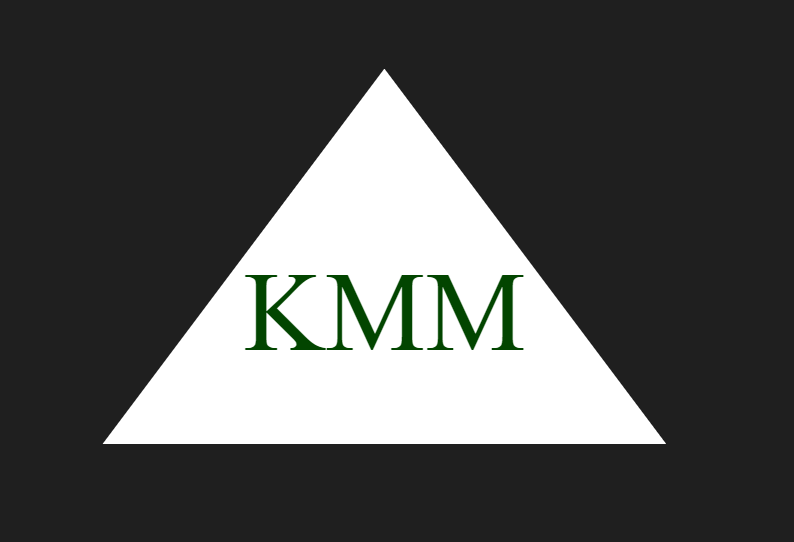

# SVG Logo Maker

## Description

A Node.js command-line application that takes in user input to generate a logo and save it as an SVG file.

## Table of Contents

- [Installation](#installation)
- [Usage](#usage)
- [License](#license)
- [Tests](#tests)

## Installation

N/A

## Usage

To use this application, first navigate to the root directory in your terimanl then run "node index.js". Follow the prompts, once finished a new SVG file will be located in the examples folder titled with whatever text you inputed and the shape you chose.

You can watch a demo of my application being used here => https://drive.google.com/file/d/1mOhv0fnDbUotjYKgbBOVbWvZT4O0TxXG/view

## Credits

N/A

## License

## Tests

Refer to ./lib/shapes.test.js to view the tests for this application. To run the tests: first navigate to the root directory in your terimanl then run "npm test". The test results will appear shortly.